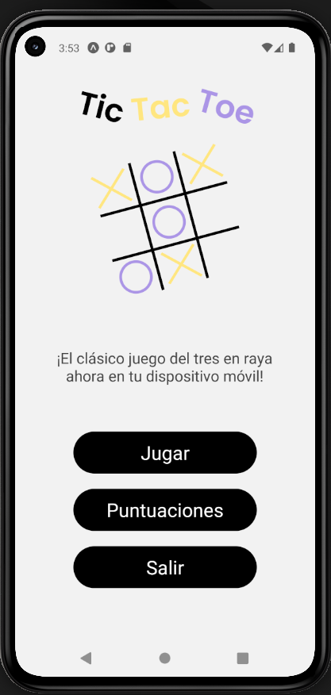
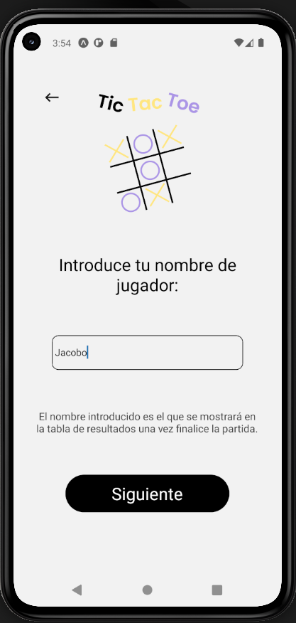
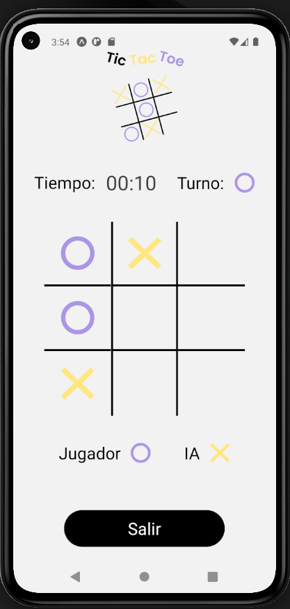
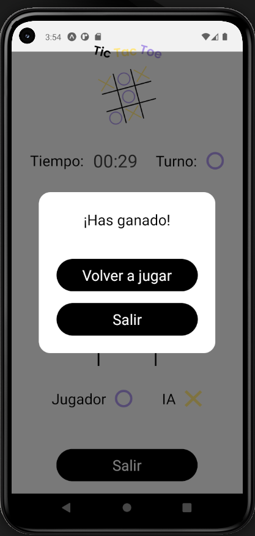
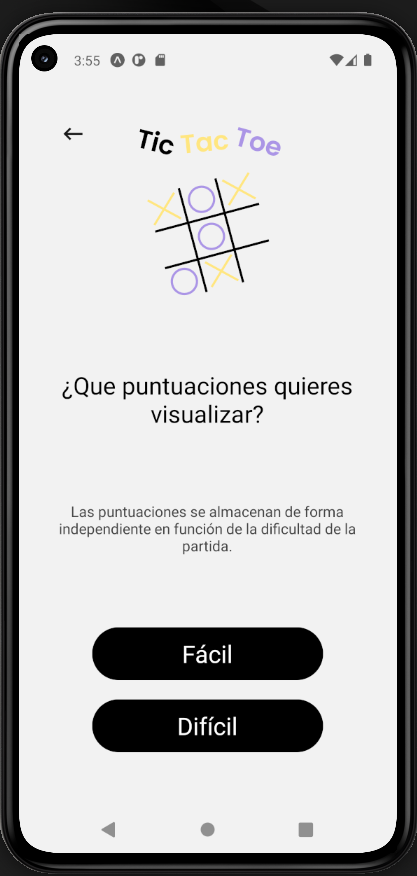
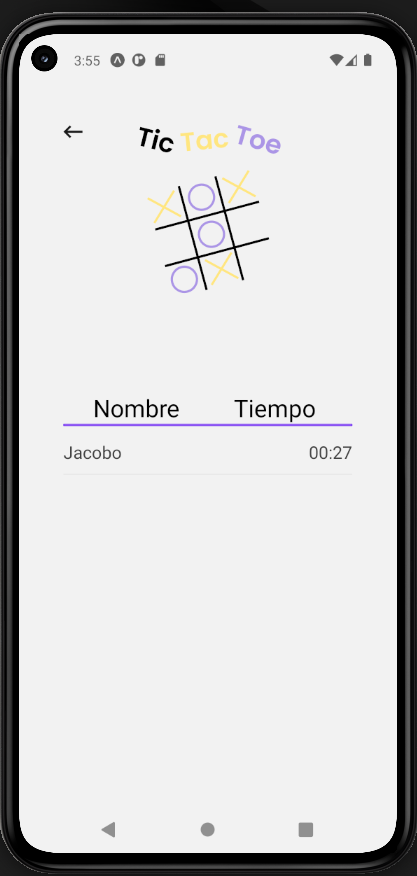

# Tic-tac-toe

Tic-Tac-Toe es una aplicación móvil interactiva desarrollada con React Native y Expo. Este proyecto traslada el clásico juego de estrategia a una experiencia moderna y fluida, ofreciendo diferentes niveles de dificultad contra una IA inteligente y un sistema de persistencia de datos local para registrar los mejores tiempos de los jugadores.

---

## Características principales:

- **Dificultad Adaptativa de la IA:** Implementación de dos niveles de inteligencia artificial. El modo "Fácil" utiliza una lógica de búsqueda secuencial, mientras que el modo "Difícil" emplea algoritmos de decisión para bloquear jugadas del usuario y priorizar sus propias victorias.

- **Persistencia de Datos con SQLite:** Integración de la librería expo-sqlite para el almacenamiento persistente. Las puntuaciones (nombre, tiempo y dificultad) se guardan de forma local, permitiendo consultar rankings históricos incluso tras cerrar la aplicación.

- **Gestión de Estado Compleja:** Control preciso del flujo de la partida mediante hooks de React (useState, useEffect), gestionando turnos alternos entre jugador e IA, detección de victorias, empates y limpieza de temporizadores.

- **Navegación Fluida con Expo Router:** Arquitectura basada en un sistema de rutas de archivos, facilitando la transición entre pantallas (Menú, Configuración, Partida y Puntuaciones) y el paso de parámetros entre ellas.

- **Interfaz de Usuario Limpia y Moderna:** Diseño UI minimalista que utiliza componentes nativos y gráficos vectoriales (SVG) para garantizar una visualización nítida en cualquier resolución de pantalla móvil.

- **Sistema de Temporizador en Tiempo Real:** Seguimiento preciso de la duración de cada partida, formateando milisegundos en una interfaz amigable (MM:SS).

- **Experiencia de Usuario Dinámica:** Uso de modales interactivos para mostrar resultados de la partida y facilitar el reinicio rápido del juego o la navegación al menú principal sin interrumpir la experiencia.

---

## Diseño en figma

https://www.figma.com/design/ly1gCOVXNZNKMHY2hmbYNp/tresEnRaya?node-id=0-1&t=wJl0AU37APHe6tCi-1

---

## Tecnologías utilizadas:

- **Framework:** React Native (Expo)

- **Navegación:** Expo Router

- **Lenguaje principal:** TypeScript y JavaScript

- **Base de Datos:** SQLite (expo-sqlite)

---

## Imágenes en ejecución:

### Menú Principal

### Selección de nombre

### Gameplay (Partida en curso)

### Resultado y opciones

### Tabla de Puntuaciones

